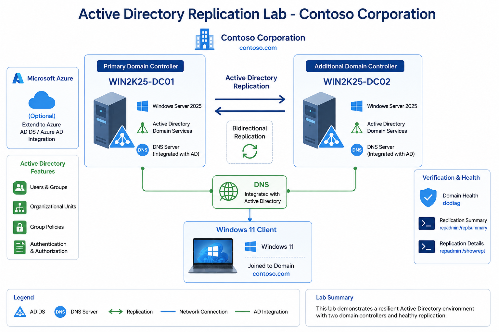

# Active Directory Replication Lab

**Primary & Additional Domain Controllers with Replication Verification**

## Overview
This lab demonstrates the deployment of a multi-domain controller Active Directory environment with proper replication configuration using Windows Server 2025.

## 🏗️ Architecture

## Lab Objectives
- Install Active Directory Domain Services
- Configure DNS integrated with AD
- Promote second server as Additional Domain Controller
- Verify replication between DCs
- Validate domain health using diagnostic tools

## 📋 Lab Content
- [Step-by-Step Guide](./Step-by-Step-Guide.md)
- [Verification](./Verification.md)

**Lab Completed Successfully!** 🎉

---

⭐ Star this repo if it helped you with Active Directory learning!
